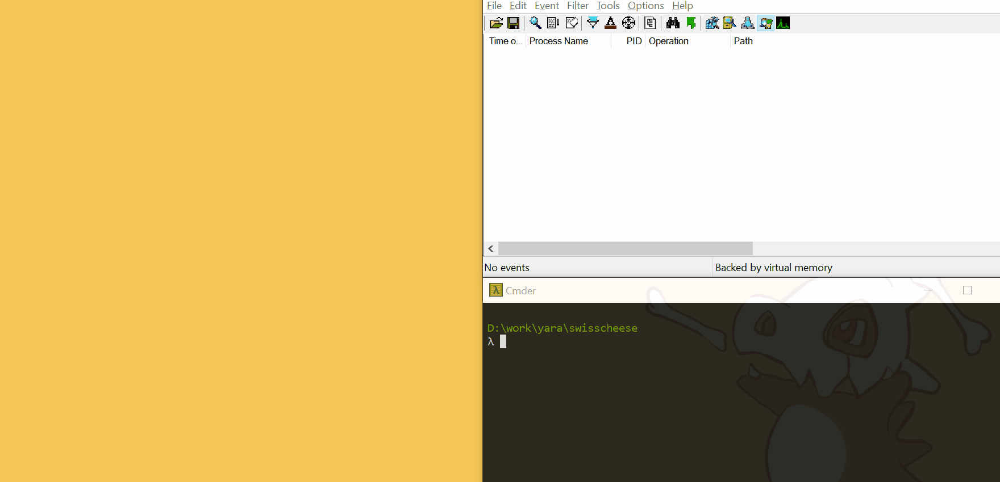

## SwissCheese Exploit
```
    Swiss         
         _-""-.
      .-"      "-.
     |""--..      '-.
     |      ""--..   '-.
     |.-. .-".    ""--..".
     |'./  -_'  .-.      |
     |      .-. '.-'   .-'
     '--..  '.'    .-  \-.
          ""--..   '_'   :
                ""--..   |
    Cheese            ""-' 

```
PoC exploit for YARA 3.7.1 32 bit using `CVE-2018-12034` and `CVE-2018-12035`.



Details [here](//bnbdr.github.io/posts/swisscheese/)