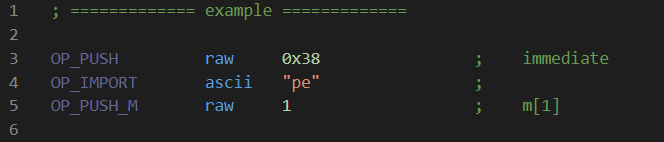

# PoC YARA Exploits

- 3.7.1 32 bit using `CVE-2018-12034` and `CVE-2018-12035` ([write-up](//bnbdr.github.io/posts/swisscheese/)).
- 3.8.1 32 bit using `CVE-2018-19974`, `CVE-2018-19975` and `CVE-2018-19976` ([write-up](//bnbdr.github.io/posts/extracheese/))


## YARASM Syntax Highlighting for VSCode
Install by copying `yarasm-syntax` folder to `%USERPROFILE%\.vscode\extensions\`



## Usage
```bat
usage: build.py [-h] [-y YARA_ASM] [-v {3.8.1,3.7.1}] [-o OUTPUT]

optional arguments:
  -h, --help            show this help message and exit
  -y YARA_ASM, --yara-asm YARA_ASM
                        yara asm file, defaults to "extracheese.yarasm"
  -v {3.8.1,3.7.1}, --target-version {3.8.1,3.7.1}
                        yara version
  -o OUTPUT, --output OUTPUT
                        defaults to "extracheese.rule"
```

